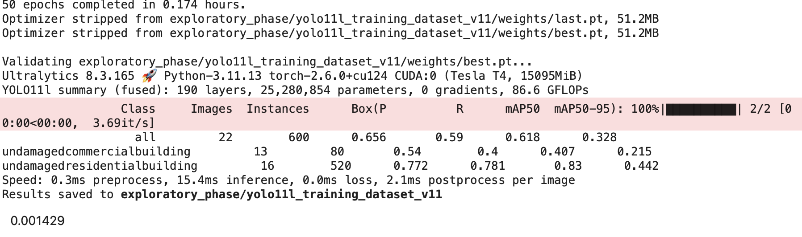
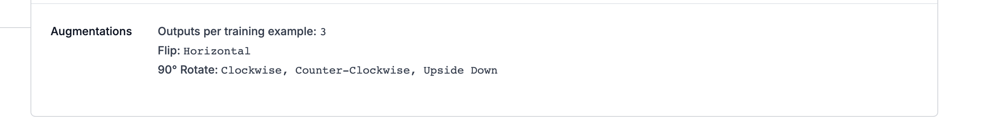

# Guidliness

For more details & best practices of 'MarkDown Documentation'
[https://community.ibm.com/community/user/blogs/hiren-dave/2025/05/27/markdown-documentation-best-practices-for-document]

[development] 2025-07-12

## Understanding Сurrent Results

After months of investigation, the following confusion matrix was achieved using a training dataset v4 from toboflow.

## Confusion Matrix Normalized

## Confusion Matrix Raw

Observations:
- The only class which has high accuracy of prediction is 'undamagedresidentialbuilding' at 80%. 
- all remaining classes are around 40-60% mark, which isn't very good. 
- Main issue is that background had high prediction values for most real classes.
- Looking at the raw confusion matrix we clearly see a strong disbalance between the different classes. 'undamagedresidentialbuilding' has the highest representation and

Conclusions:
- 

[development] 2025-07-13

If training mAP50 is decreasing during training while the validation mAP50 value is higher, it could mean that the model overfitting and we need to reduce the learning rate (typically: 0.1 - 0.001). But in our case YOLOv11 a good learning rate is around (0.000005 - 0.00001).

Latest results suggest that 'l' model is better than 'n' model, but the difference is not much.
Then we clearly see that residential buildinds are at 0.8 (80%) already good value, while commercial buildings are at 0.4 (40%) which is much lower. This could come from the unbalance of number of images per class (1500+ vs ~500, to double check exact numbers)

#### Data Augmentation on Roboflow

The onces that seems to work the best are depicted at the screenshot below, they help us increase the number of images artificially, especially in the current problem where we try to detect buildings and similar buildings can be rotated in different direcitons. 
